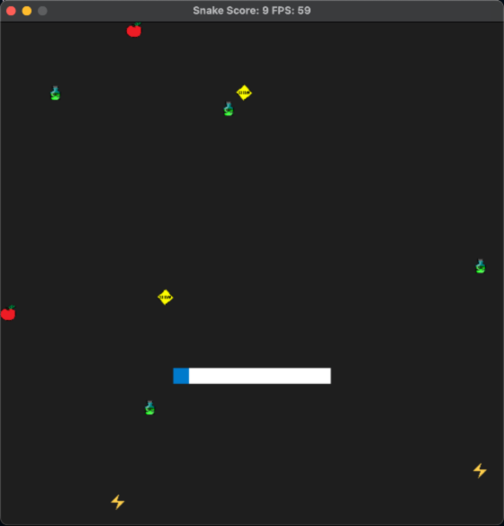

# Snake++ Game

The code for this repo was inspired by [this](https://codereview.stackexchange.com/questions/212296/snake-game-in-c-with-sdl) excellent StackOverflow post and set of responses.

[Watch the video](https://youtu.be/CQpWfHMSWvs)

## Game Rules
1. Collecting the apples increases the score and speeds up the snake.
2. Collecting lightning speeds up the snake.
3. Collecting the yellow slow/caution diamond will slow down the snake.
4. Collecting poision bottle or colliding into the body will lead to the game ending.

## Changing the Game Config
Change the numbers in the game-config.txt file to change the game config.
1. First line contains config for the number of poison bottles on the grid.
2. Second line contains config for the number of yellow slowdown/caution diamonds on the grid.
3. Third line contains config for the number of lightning speedups on the grid.
4. Finally, the last line contains config for the number of apples on the grid.

## Dependencies for Running Locally
* cmake >= 3.7
  * All OSes: [click here for installation instructions](https://cmake.org/install/)
* make >= 4.1 (Linux, Mac), 3.81 (Windows)
  * Linux: make is installed by default on most Linux distros
  * Mac: [install Xcode command line tools to get make](https://developer.apple.com/xcode/features/)
  * Windows: [Click here for installation instructions](http://gnuwin32.sourceforge.net/packages/make.htm)
* SDL2 >= 2.0
  * All installation instructions can be found [here](https://wiki.libsdl.org/Installation)
  >Note that for Linux, an `apt` or `apt-get` installation is preferred to building from source. 
* gcc/g++ >= 5.4
  * Linux: gcc / g++ is installed by default on most Linux distros
  * Mac: same deal as make - [install Xcode command line tools](https://developer.apple.com/xcode/features/)
  * Windows: recommend using [MinGW](http://www.mingw.org/)

## Basic Build Instructions

1. Execute the build script with `./build.sh` to build the project.
2. To run execute the `./run.sh` script. The run script can be executed without the build script as well. 

#### Alternatively, follow the below procedure:

1. Clone this repo.
2. Make a build directory in the top level directory: `mkdir build && cd build`
3. Compile: `cmake .. && make`
4. Run it: `./SnakeGame`.

## Project Specifications
### Compiling and Testing
- The submission must compile and run.

### Loops, Functions, I/O
- The project demonstrates an understanding of C++ functions and control structures: The code uses [loops](https://github.com/l0g1c-80m8/snake-plus-plus/blob/f75ef337fc4a10335efb883b752fdc50d07b3db6/src/game.cpp#L127), [conditionals](https://github.com/l0g1c-80m8/snake-plus-plus/blob/f75ef337fc4a10335efb883b752fdc50d07b3db6/src/game.cpp#L89), [switch](https://github.com/l0g1c-80m8/snake-plus-plus/blob/f75ef337fc4a10335efb883b752fdc50d07b3db6/src/game.cpp#L60) and [functions](https://github.com/l0g1c-80m8/snake-plus-plus/blob/f75ef337fc4a10335efb883b752fdc50d07b3db6/src/game.cpp#L132).
- The project reads data from a file and process the data, or the program writes data to a file: Config is [read from a text file](https://github.com/l0g1c-80m8/snake-plus-plus/blob/f75ef337fc4a10335efb883b752fdc50d07b3db6/src/config.cpp#L26).
- The project accepts user input and processes the input: The game records [user input](https://github.com/l0g1c-80m8/snake-plus-plus/blob/f75ef337fc4a10335efb883b752fdc50d07b3db6/src/controller.cpp#L10) to move the snake.
  
### Object Oriented Programming
- The project uses Object Oriented Programming techniques: The project code is organized into classes such as config, controller, snake, obstacles, and renderer. Some classes are implemented using the singleton pattern, for example [config](https://github.com/l0g1c-80m8/snake-plus-plus/blob/f75ef337fc4a10335efb883b752fdc50d07b3db6/src/config.cpp#L11) and [snake](https://github.com/l0g1c-80m8/snake-plus-plus/blob/f75ef337fc4a10335efb883b752fdc50d07b3db6/src/snake.cpp#L80) classes. In renderer class an [inner class](https://github.com/l0g1c-80m8/snake-plus-plus/blob/f75ef337fc4a10335efb883b752fdc50d07b3db6/src/renderer.h#L24) that acts as a resource holder is used.
- Classes use appropriate access specifiers for class members: All members are marked under private and public according to their usage.
- Class constructors utilize member initialization lists whenever applicable.
- Classes encapsulate behavior: For example the [config](https://github.com/l0g1c-80m8/snake-plus-plus/blob/f75ef337fc4a10335efb883b752fdc50d07b3db6/src/config.h#L11) class that reads the config from a file on init.

### Memory Management
- The project makes use of references in function declarations: For example in [game.h](https://github.com/l0g1c-80m8/snake-plus-plus/blob/f75ef337fc4a10335efb883b752fdc50d07b3db6/src/game.h#L16) and [controller.h](https://github.com/l0g1c-80m8/snake-plus-plus/blob/f75ef337fc4a10335efb883b752fdc50d07b3db6/src/controller.h#L8).
- The project uses destructors appropriately: For example in the [Rendered:SDL_Resources](https://github.com/l0g1c-80m8/snake-plus-plus/blob/f75ef337fc4a10335efb883b752fdc50d07b3db6/src/renderer.cpp#L153) class.
- The project uses smart pointers instead of raw pointers: For example in [config](https://github.com/l0g1c-80m8/snake-plus-plus/blob/f75ef337fc4a10335efb883b752fdc50d07b3db6/src/config.h#L26) class, [renderer](https://github.com/l0g1c-80m8/snake-plus-plus/blob/f75ef337fc4a10335efb883b752fdc50d07b3db6/src/renderer.h#L34) class, [snake](https://github.com/l0g1c-80m8/snake-plus-plus/blob/f75ef337fc4a10335efb883b752fdc50d07b3db6/src/snake.h#L11) class.
- The project uses move semantics to move data, instead of copying it, where possible: For example in the [game](https://github.com/l0g1c-80m8/snake-plus-plus/blob/f75ef337fc4a10335efb883b752fdc50d07b3db6/src/game.cpp#L124) class.
